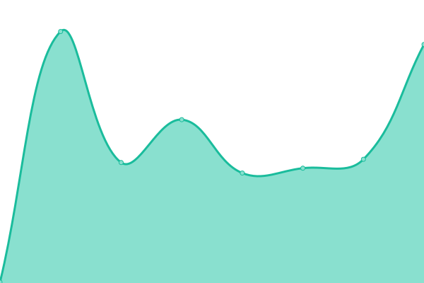
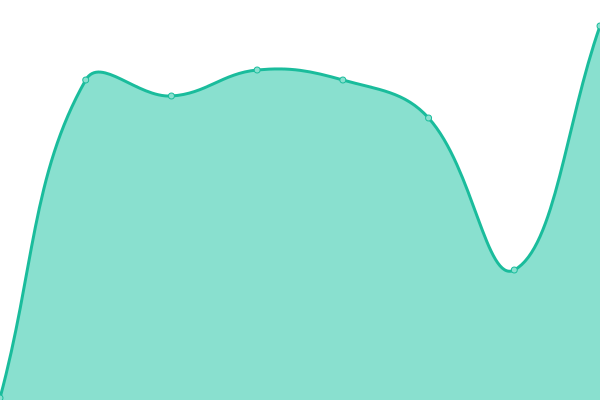

# [📈 Live Status](https://rybesh.github.io/status): <!--live status--> **🟩 All systems operational**

This repository contains the open-source uptime monitor and status page for [Ryan Shaw](http://aeshin.org/), powered by [Upptime](https://github.com/upptime/upptime).

With [Upptime](https://upptime.js.org), you can get your own unlimited and free uptime monitor and status page, powered entirely by a GitHub repository. We use [Issues](https://github.com/rybesh/status/issues) as incident reports, [Actions](https://github.com/rybesh/status/actions) as uptime monitors, and [Pages](https://rybesh.github.io/status) for the status page.

<!--start: status pages-->
<!-- This summary is generated by Upptime (https://github.com/upptime/upptime) -->
<!-- Do not edit this manually, your changes will be overwritten -->
<!-- prettier-ignore -->
| URL | Status | History | Response Time | Uptime |
| --- | ------ | ------- | ------------- | ------ |
|  [Aeshin](https://aeshin.org) | 🟩 Up | [aeshin.yml](https://github.com/rybesh/status/commits/HEAD/history/aeshin.yml) | 

 253ms
     
 | 

<a href="https://rybesh.github.io/status/history/aeshin">100.00%</a>
    

|  [Linked Events](https://linkedevents.org) | 🟩 Up | [linked-events.yml](https://github.com/rybesh/status/commits/HEAD/history/linked-events.yml) | 

 2113ms
     
 | 

<a href="https://rybesh.github.io/status/history/linked-events">100.00%</a>
    

|  [UNC-CH AAUP](https://unc-ch-aaup.org) | 🟩 Up | [unc-ch-aaup.yml](https://github.com/rybesh/status/commits/HEAD/history/unc-ch-aaup.yml) | 

 256ms
     
 | 

<a href="https://rybesh.github.io/status/history/unc-ch-aaup">100.00%</a>
    

|  [Deals](https://deals.fly.dev) | 🟩 Up | [deals.yml](https://github.com/rybesh/status/commits/HEAD/history/deals.yml) | 

 152ms
     
 | 

<a href="https://rybesh.github.io/status/history/deals">100.00%</a>
    

|  [Feedme](https://feedme.fly.dev) | 🟩 Up | [feedme.yml](https://github.com/rybesh/status/commits/HEAD/history/feedme.yml) | 

 311ms
     
 | 

<a href="https://rybesh.github.io/status/history/feedme">100.00%</a>
    

|  [NC Gazetteer](https://ncgazetteer.org) | 🟩 Up | [nc-gazetteer.yml](https://github.com/rybesh/status/commits/HEAD/history/nc-gazetteer.yml) | 

 250ms
     
 | 

<a href="https://rybesh.github.io/status/history/nc-gazetteer">100.00%</a>
    

|  [Fedwiki](https://fedwiki.fly.dev) | 🟩 Up | [fedwiki.yml](https://github.com/rybesh/status/commits/HEAD/history/fedwiki.yml) | 

 1673ms
     
 | 

<a href="https://rybesh.github.io/status/history/fedwiki">100.00%</a>
    

<!--end: status pages-->

[**Visit our status website →**](https://rybesh.github.io/status)

## 📄 License

- Powered by: [Upptime](https://github.com/upptime/upptime)
- Code: [MIT](./LICENSE) © [Ryan Shaw](http://aeshin.org/)
- Data in the `./history` directory: [Open Database License](https://opendatacommons.org/licenses/odbl/1-0/)
